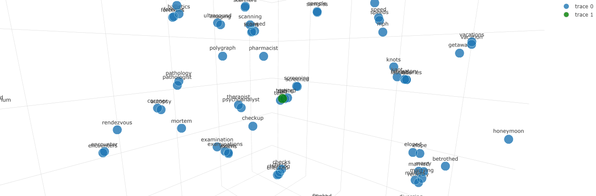

# visualizing-word-vectors
> **Warning**: This version of the software does not fully support 2D and it may not be stable.

Systems that can visualize word embedding vectors in 3D and 2D spaces.

## Installation
First, ``git clone`` this repository into a directory on your computer. Then, run [server.py](/server.py).
```
Running on http://xxx.xxx.xxx.xxx:8080/ (Press CTRL+C to quit)
```
When you see something like this, go to that URL and you will be redirected to the contents of your [index.html](/templates/index.html) file.

## Generating 3D or 2D vectors from the Semantle corpus
The [MDVectors](static/unreduced_vectors/MDVectors.json) file contains a large amount (25,000) of words and vectors that are similar to the words in the Semantle corpus. **No additional action is required if you want to generate charts based on the Semantle words.**

## Generating 3D or 2D vectors from an [nltk corpus](https://www.nltk.org/api/nltk.corpus.html)
> **Note**: You can avoid this entire section if you wish to use the [Semantle](https://semantle.com/) corpus. The [2D Vector](static/corpora/2DVectors.json) and [3D Vector](static/corpora/3DVectors.json) files are both made up of a corpus similar to the Semantle corpus.

A commonly used corpus is called the [brown corpus](http://korpus.uib.no/icame/brown/bcm.html). We will use the brown corpus in this example.

### Generating
Running the following code generates a 3D vector ``.json`` file from the brown corpus.

```py
from nltk.corpus import brown
from model import GenerateVectorsFile, Model

NewModel = Model(corpus=brown, dimensions=3)
Path = "static/corpora/3DVectors-new.json"

NewModel.GenerateVectorsFile(Path)
```

## Understanding the system
### Data
Word vectors are stored in a ``.json`` file such as the provided [3D vectors](static/corpora/3DVectors.json) file. Each json contains a word as a key, and the dimensions as values.

```json
{
    "in": [
        2.0589427947998047, // X
        -0.4056415557861328, // Y
        -35.34573745727539 // Z (If 3D charts are enabled)
    ]
}
```

### The program itself
The program converts multi-dimensional word vectors into 2D or 3D by using [t-SNE](https://scikit-learn.org/stable/modules/generated/sklearn.manifold.TSNE.html). There is a [helpful video](https://youtu.be/NEaUSP4YerM?t=79) on how t-SNE converts these dimensions.

These dimensions are then projected onto [plot.ly](https://plotly.com/javascript/) or [chartjs](https://www.chartjs.org/) plots.

## JS Functions & Documentation
### Loading the library
#### VisualizeJs
```js
new VisualizeJs();
```
##### Arguments:
- ``string`` ``required``: Dimension
- ``string`` ``required``: Path to vector file
- ``string`` ``required``: The ID of the element that it attaches to
##### Examples:
Creating a 3D Chart.
```js
Visualization = new VisualizeJs("3D", '/static/corpora/3DVectors.json');
```

Creating a 2D Chart.
```js
Visualization = new VisualizeJs("2D", '/static/corpora/3DVectors.json');
```

```html
<body>
    <div id="chart"></div>
</body>
<footer>
    <script>
        Visualization = new VisualizeJs("3D", '/static/corpora/3DVectors.json', "chart");
    </script>
</footer>
```

### Other Functions
#### RenderAll
```js
Visualization.RenderAll();
```
> **Note**: If you are using a large corpus, Plotly struggles with adding the word text as a label to each point. It may take a long time to load or hang forever. Use the ``.RenderSome()`` function to render a select number of words near a specific point.
##### Arguments:
None
##### Returns:
The plotly chart object.
##### Examples:
```html
<body>
    <div id="chart"></div>
</body>
<footer>
    <script>
        Visualization = new VisualizeJs("3D", '/static/corpora/3DVectors.json', "chart");
        Visualization.RenderAll();
    </script>
</footer>
```

#### RenderClosestWords
```js
Visualization.RenderClosestWords();
```
##### Arguments:
- ``string`` ``case sensitive`` ``required``: The word that you want to display words related to
- ``float`` ``required``: The view distance (the size of the radius or square that words are included in)
##### Returns:
The plotly chart object.
##### Examples:
```html
<body>
    <div id="chart"></div>
</body>
<footer>
    <script>
        Visualization = new VisualizeJs("3D", '/static/corpora/3DVectors.json', "chart");
        Visualization.RenderClosestWords("university"); // Renders words similar to "university"
    </script>
</footer>
```


#### RenderClosestWordsToVector
```js
Visualization.RenderClosestWordsToVector();
```
> Similar to ``.RenderClosestWords()`` but instead of inputting a word, you can input specific coordinates.
##### Arguments:
- ``float`` ``required``: X position
- ``float`` ``required``: Y position
- ``float`` ``optional``: Z position (will be ignored if visualization is set to "2D" mode)
- ``float`` ``required``: The view distance (the size of the radius or square that words are included in)
##### Returns:
The plotly chart object.
##### Examples:
```html
<body>
    <div id="chart"></div>
</body>
<footer>
    <script>
        Visualization = new VisualizeJs("3D", '/static/corpora/3DVectors.json', "chart");
        Visualization.RenderClosestWordsToVector(27, 48.5, 39.2, 5);
    </script>
</footer>
```

#### RenderWords
```js
Visualization.RenderWords();
```
> Similar to ``.RenderClosestWords()`` but instead of inputting a word, you can input specific coordinates.
##### Arguments:
- ``float`` ``required``: X position
- ``float`` ``required``: Y position
- ``float`` ``optional``: Z position (will be ignored if visualization is set to "2D" mode)
- ``float`` ``required``: The view distance (the size of the radius or square that words are included in)
##### Returns:
The plotly chart object.
##### Examples:
```html
<body>
    <div id="chart"></div>
</body>
<footer>
    <script>
        Visualization = new VisualizeJs("3D", '/static/corpora/3DVectors.json', "chart");
        Visualization.RenderClosestWordsToVector(27, 48.5, 39.2, 5);
    </script>
</footer>
```

### Custom Datatypes
#### Words and Wordlists
